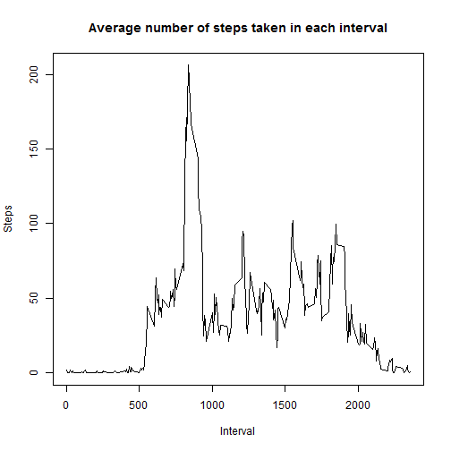
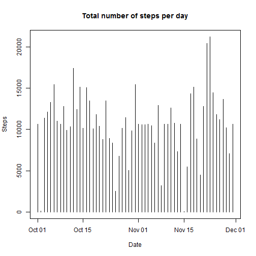
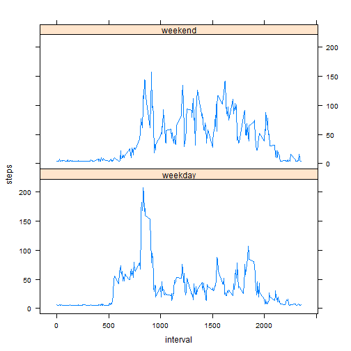

# Course Project 1 - Reproducible Research


## Loading and preprocessing the data

Load data.


```r
activity <- read.csv("activity.csv", header = TRUE, na.strings = "NA")
head(activity)
```

```
##   steps       date interval
## 1    NA 2012-10-01        0
## 2    NA 2012-10-01        5
## 3    NA 2012-10-01       10
## 4    NA 2012-10-01       15
## 5    NA 2012-10-01       20
## 6    NA 2012-10-01       25
```


Formatting date.


```r
activity$date <- as.Date(activity$date, "%Y-%m-%d")
# Verifiy class column date
class(activity$date)
```

```
## [1] "Date"
```


## What is mean total number of steps taken per day?

For this part, we will ignore the missing values.


```{r simpleplot}
aggr_activity <- aggregate(steps ~ date, data=activity, sum, na.action = na.omit)
plot(aggr_activity$date, aggr_activity$steps, type="h", xlab = "Date", ylab = "Total number of steps", main = "Total number of steps taken each day")
```


### Mean and median of the total number of steps taken per day


```r
mean <- mean(aggr_activity$steps)
mean
```

```
## [1] 10766.19
```

```r
median <- median(aggr_activity$steps)
median
```

```
## [1] 10765
```


## What is the average daily activity pattern?

Time series plot of the 5 minutes interval and the average of steps. 


```r
mean_per_interval <- aggregate(steps ~ interval, data=activity, FUN = "mean", na.action = na.omit)
plot(mean_per_interval$interval, mean_per_interval$steps, type = "l", xlab = "Interval", ylab = "Steps", main = "Average number of steps taken in each interval")
```




### The 5-minute interval which contains the maximum number of steps

The 5-minute interval that contains the maximum number of steps is:


```r
head(mean_per_interval[order(mean_per_interval$steps,decreasing=TRUE),],1)
```

```
##     interval    steps
## 104      835 206.1698
```


## Imputing missing values

The total of missing values in the dataset 


```r
na_missing <- is.na(activity$steps)
length(na_missing[na_missing==TRUE])
```

```
## [1] 2304
```


The missing values will be replaced by the mean value of the dataset.


```r
activity_impute <- activity
activity_impute$steps <- ifelse(is.na(activity$steps), round(mean(activity$steps, na.rm = TRUE),digits=0), activity$steps) 
```


### Histogram total steps per day with imputed data


```r
aggr_activity_impute <- aggregate(steps ~ date, data=activity_impute, sum, na.action = na.omit)
plot(aggr_activity_impute$date, aggr_activity_impute$steps, type="h", xlab = "Date", ylab = "Steps", main = "Total number of steps per day")
```




### Mean and median of the total number of steps taken per day


```r
mean_per_day_impute <- mean(aggr_activity_impute$steps)
mean_per_day_impute
```

```
## [1] 10751.74
```

```r
median_per_day_impute <- median(aggr_activity_impute$steps)
median_per_day_impute
```

```
## [1] 10656
```

Filling the missing values with the mean of the dataset does not have a big impact on the mean and the median of the dataset.


## Are there differences in activity patterns between weekdays and weekends?

Create a new factor variable with two levels (weekday and weekend)


```r
weekday <- c("Monday", "Tuesday", "Wednesday", "Thursday", "Friday")
activity_impute$day <- factor(weekdays(activity_impute$date) %in% weekday, levels = c(TRUE,FALSE), labels = c("weekday", "weekend"))
```


### Time series plot of the 5-minute interval and the average number of steps taken across all weekdays and weekend days


```r
library(lattice)
mean_per_interval_impute <- aggregate(steps ~ interval+day, data=activity_impute, FUN="mean", na.action = na.omit)
xyplot(steps ~ interval | day, data = mean_per_interval_impute, layout = c(1, 2), type="l")
```




